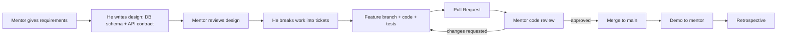

# Fresher Training Plan – Python Backend Developer (FastAPI + MySQL)

## Current Level
- Python: Knows basics
- FastAPI: Knows basics
- Database: Basic SQL
- DSA: Little knowledge

## Goal
Get job-ready as a **Python Backend / Full-Stack Developer (Junior)** by building a few solid projects, with enough DSA and fundamentals to clear interviews.

Your approach is right: **2–3 well-built projects beat 10 tutorial clones.** Interviewers ask about design decisions, errors faced and trade-offs, and only real projects prepare him for that.

## How This Plan Is Split

| Area | Who drives it | Mentor's role |
|---|---|---|
| Python, SQL, REST, Git, frontend basics, DSA, CS theory | **Self-learning** | Weekly 15-min quiz / doubt clearing only |
| Projects (Phase 4) | **Mentor-guided** | Acts as Tech Lead + Product Owner: gives requirements, reviews design and code, creates real-world scenarios |
| Resume and interviews | Together | Mock interviews, resume review |

**Rule:** He learns concepts on his own, and applies them in guided projects where the mentor teaches *how real teams work*.

---

# Part A – Self-Learning (He Does This On His Own)

Free resources: official Python docs, FastAPI docs (the tutorial is excellent), SQLAlchemy docs, W3Schools / SQLBolt for SQL, freeCodeCamp / YouTube, LeetCode.

## Phase 1 – Strengthen Fundamentals

### 1. Python (Intermediate)
- [ ] Data types, list/dict/set comprehensions
- [ ] Functions, `*args` / `**kwargs`, lambda
- [ ] OOP: classes, inheritance, `@property`, dunder methods
- [ ] Exception handling, custom exceptions
- [ ] Modules, packages, virtual environments (`venv`), `pip`, `requirements.txt`
- [ ] Type hints (needed for FastAPI and Pydantic)
- [ ] Decorators, generators, context managers (`with`)
- [ ] `async` / `await` basics (FastAPI depends on it)
- [ ] File handling, JSON, `datetime`, `logging`

### 2. Git & GitHub (Must-have)
- [ ] `init`, `add`, `commit`, `push`, `pull`, `clone`
- [ ] Branching, merging, resolving conflicts
- [ ] Pull requests and a good `README.md`
- [ ] Commit every day. A green GitHub profile helps.

### 3. SQL / MySQL (Go deeper)
- [ ] DDL/DML: `CREATE`, `ALTER`, `INSERT`, `UPDATE`, `DELETE`
- [ ] `SELECT`, `WHERE`, `ORDER BY`, `LIMIT`, `GROUP BY`, `HAVING`
- [ ] JOINs: INNER, LEFT, RIGHT, self join
- [ ] Subqueries, aggregate functions
- [ ] Primary key, foreign key, unique, constraints
- [ ] Normalization (1NF, 2NF, 3NF)
- [ ] Indexes: when and why to use them
- [ ] Transactions and ACID
- [ ] Practice: LeetCode SQL 50, HackerRank SQL

### 4. HTTP & REST Concepts
- [ ] HTTP methods: GET, POST, PUT, PATCH, DELETE
- [ ] Status codes: 200, 201, 204, 400, 401, 403, 404, 422, 500
- [ ] Headers, query params, path params, request body
- [ ] REST design: resource naming, versioning (`/api/v1/...`), pagination, filtering
- [ ] Idempotency, stateless APIs
- [ ] Tools: **Postman** and the Swagger UI (`/docs`)
- [ ] CORS: what it is and why the frontend needs it

---

## Phase 2 – FastAPI in Depth

*He reads the FastAPI docs tutorial himself; each topic is then applied in the guided projects.*

- [ ] Project structure (routers, models, schemas, services, db, core/config)
- [ ] Path/query params, request body with **Pydantic** models
- [ ] Response models, validation, custom error responses
- [ ] Dependency Injection (`Depends`)
- [ ] **SQLAlchemy ORM** with MySQL (`pymysql` / `mysqlclient`)
- [ ] **Alembic** for database migrations
- [ ] CRUD operations using sessions
- [ ] Relationships: one-to-many, many-to-many
- [ ] **Authentication**: password hashing (`bcrypt` / `passlib`), **JWT** login
- [ ] Role-based authorization (admin/user)
- [ ] Environment variables with `.env` + `pydantic-settings` (never hardcode secrets)
- [ ] Middleware, CORS setup
- [ ] Background tasks
- [ ] File upload
- [ ] Pagination and search APIs
- [ ] Logging and global exception handling
- [ ] **Testing** with `pytest` + `TestClient`

### Recommended Backend Folder Structure
```
app/
├── main.py
├── core/          # config, security (JWT, hashing)
├── db/            # session, base
├── models/        # SQLAlchemy models
├── schemas/       # Pydantic schemas
├── routers/       # API routes
├── services/      # business logic
└── tests/
alembic/
.env.example
requirements.txt
README.md
```

---

## Phase 3 – Basic Frontend (To Display Data in UI)

He does not need to become a frontend expert, just good enough to consume his own APIs.

**Option A (simplest):** HTML + CSS + JavaScript (`fetch` API) + Bootstrap
**Option B (better for jobs):** **React** basics

- [ ] HTML, CSS basics, Flexbox, Bootstrap or Tailwind
- [ ] JavaScript: variables, functions, arrays, objects, promises, `async/await`, `fetch`
- [ ] React: components, props, `useState`, `useEffect`, forms, React Router, Axios
- [ ] Storing the JWT and sending it in the `Authorization` header
- [ ] Showing loading states and error messages

---

# Part B – Mentor-Guided Projects (Real Work Experience)

## Phase 4 – Projects Run Like a Real Job

The aim is not just "build an app". He should experience **how software is built in a company**: requirements, design, tickets, branches, pull requests, code review, bugs, changing requirements, deployment and demos.

### Mentor Plays These Roles
- **Product Owner:** writes user stories and acceptance criteria, changes requirements mid-way
- **Tech Lead:** reviews DB design and API contract before coding, reviews every PR
- **QA / Customer:** tests the app, raises bug tickets
- **On-call Senior:** simulates production issues for him to debug

### Working Process (Same as a Real Team)



### Team Rules to Enforce From Day 1
- [ ] Work tracked on a **GitHub Projects board** (To Do / In Progress / In Review / Done)
- [ ] **No direct push to `main`**: feature branch → PR → review → merge (set branch protection)
- [ ] Branch names: `feature/task-crud`, `bugfix/login-500-error`
- [ ] Commit messages: `feat: add task filter API`, `fix: handle duplicate email`
- [ ] Every PR has a description, screenshots (for UI) and the tests he ran
- [ ] Small PRs (ideally < 300 lines)
- [ ] Try on his own for **45–60 minutes** before asking for help, and when asking, share what he tried
- [ ] AI tools are allowed, but he must explain every line in review. If he can't, it gets rewritten.

### Weekly Cadence
| When | Activity | Duration |
|---|---|---|
| Monday | Sprint planning: pick tickets for the week | 30 min |
| Daily | Async standup message (template below) | 5 min |
| Mid-week | Check-in / unblock / pair-programming if stuck | 30 min |
| Anytime | PR reviews by mentor (within 24 hrs) | – |
| Friday | Demo + retrospective (what went well, what to improve) | 45 min |

**Daily standup template:**
```
Yesterday: Completed login API + tests (PR #12)
Today: Start task list UI
Blockers: CORS error when calling API from React
```

---

### Project 1: Team Task Manager (Beginner)
**Stack:** FastAPI + MySQL + SQLAlchemy + Alembic + React (or HTML/JS)
**Focus:** Learn the team workflow, CRUD, auth, and connecting the UI to the API

| Sprint | Deliverables | Mentor teaches / reviews |
|---|---|---|
| 1 – Design & Setup | Requirements discussion, ER diagram, API contract (endpoint list with request/response), repo setup, folder structure, `.env`, Alembic | How to read requirements and ask questions; DB design review; API naming |
| 2 – Auth | Signup, login, JWT, password hashing, protected routes | Security basics, never log passwords, proper status codes |
| 3 – Task CRUD + UI | Task APIs, user sees only own tasks, React pages: login, list, create/edit | Separation of routers / services / DB; frontend state; handling API errors in UI |
| 4 – Polish | Filter, search, pagination, pytest tests, README | Writing tests, a good README, how to demo |

**Real-world twist (mentor introduces in Sprint 3):**
> "Customer wants tasks to be **shared with teammates** and to see who changed what."
→ He must change the schema (many-to-many + audit table), write an Alembic migration **without losing existing data**, and update the APIs.

**Bug tickets mentor raises:**
- Duplicate email signup returns 500 instead of 400
- User A can view User B's task by changing the ID in the URL (authorization bug)
- Pagination returns the same record on two pages

---

### Project 2: Expense / Inventory Management System (Intermediate)
**Stack:** FastAPI + MySQL + SQLAlchemy + Alembic + React + pytest
**Focus:** Business logic, roles, reporting SQL, performance, testing

| Sprint | Deliverables | Mentor teaches / reviews |
|---|---|---|
| 1 – Design | Requirement doc, ER diagram with 5+ related tables, API contract, role matrix (Admin / Manager / Employee) | Normalization, choosing indexes, designing for roles |
| 2 – Core APIs | CRUD for items/expenses, categories, role-based access | Dependency injection for auth/roles, service layer design |
| 3 – Workflow | Approval flow (Employee submits → Manager approves/rejects), file upload for receipts, status history | State transitions, validation, transactions |
| 4 – Reports + UI | Monthly summary, category-wise totals, top spenders (JOIN / GROUP BY), dashboard with charts | Writing efficient SQL, when to use raw SQL vs ORM |
| 5 – Quality | 70%+ test coverage, logging, global error handler, Swagger docs cleaned up | Test strategy, fixtures, test DB |

**Real-world twists:**
- **Performance issue:** Mentor seeds **100k+ rows** and says "the report page is slow". He must use `EXPLAIN`, add indexes, and fix N+1 queries.
- **Requirement change:** "Support multiple currencies" → schema change + migration + data backfill.
- **Code review exercise:** Mentor gives him a messy PR (written badly on purpose) to **review**, so he learns to read and critique others' code.

---

### Project 3: Capstone – Mini E-commerce or Job Portal (Advanced, Deployed)
**Stack:** FastAPI + MySQL + React + Docker + GitHub Actions + (Redis optional)
**Focus:** Production readiness: Docker, CI/CD, deployment, concurrency, monitoring

| Sprint | Deliverables | Mentor teaches / reviews |
|---|---|---|
| 1 – Design | High-level architecture diagram, DB schema, API contract with versioning (`/api/v1`) | System design basics, trade-offs |
| 2 – Catalog | Products/jobs with categories, search, filters, sorting, pagination, image upload | Query optimization, API design for the frontend |
| 3 – Core Flow | Cart → order (or apply → shortlist) using **DB transactions**; stock handling | Race conditions (two users buying the last item), row locking |
| 4 – Async Work | Email notifications via background tasks, order history | Background jobs, retries |
| 5 – DevOps | Dockerfile, docker-compose (API + MySQL), GitHub Actions running tests on every PR | Containers, CI pipelines |
| 6 – Deploy | Deploy to Render / Railway / AWS EC2, environment configs, health-check endpoint, structured logs | Deployment, secrets management, reading logs |

**Real-world twists:**
- **Production incident drill:** Mentor breaks something in the deployed app (wrong env var, DB connection limit, bad migration). He debugs using logs only and writes a short **incident report** (what happened, root cause, fix, prevention).
- **API versioning:** "Mobile app needs a different response format" → introduce `/api/v2` without breaking v1.
- **Hotfix flow:** Urgent bug in production → `hotfix/` branch, fix, test, deploy fast.

---

### Bonus: Work on an Existing Codebase
In real jobs, freshers mostly **maintain existing code**, not build from scratch.
- [ ] Mentor gives an existing project (his own old project or an open-source FastAPI repo)
- [ ] Task: set it up locally from the README, fix 2–3 bugs, add 1 small feature, and write tests
- [ ] Optional: contribute a `good first issue` to an open-source Python project

---

### Templates the Mentor Provides

**User story + acceptance criteria:**
```
As a Manager, I want to approve or reject expense claims
so that only valid expenses are reimbursed.

Acceptance Criteria:
- Only users with role Manager can approve/reject
- Status changes: Pending → Approved / Rejected
- Rejection requires a reason (min 10 chars)
- Employee sees the updated status and reason
- Returns 403 if an Employee tries to approve
```

**PR template (`.github/pull_request_template.md`):**
```
## What does this PR do?
## Related ticket: #
## How was it tested?
## Screenshots (if UI)
## Checklist
- [ ] Tests added/updated
- [ ] No secrets / debug prints
- [ ] README / API docs updated if needed
```

### Mentor's Code Review Checklist
- [ ] Does it meet the acceptance criteria?
- [ ] Correct HTTP status codes and error messages
- [ ] Input validation; no SQL injection (ORM / parameterized queries only)
- [ ] Authorization checked (user can only access their own data)
- [ ] No secrets in code; config comes from env
- [ ] Business logic in the service layer, not in routes
- [ ] Meaningful names, no duplicate code, small functions
- [ ] Tests cover success and failure cases
- [ ] DB queries efficient (no N+1, indexes where needed)
- [ ] Frontend handles loading and error states

### Evaluation After Each Project
| Skill | Rating (1–5) | Notes |
|---|---|---|
| Understanding requirements / asking questions | | |
| DB and API design | | |
| Code quality | | |
| Git / PR discipline | | |
| Testing | | |
| Debugging independently | | |
| Communication (standups, demo) | | |
| Can explain design decisions | | |

### Checklist for Every Project
- [ ] Clean folder structure
- [ ] `.env.example` with no secrets committed
- [ ] Input validation and proper status codes
- [ ] At least a few pytest tests
- [ ] README with: description, features, tech stack, screenshots, setup steps, API list
- [ ] Live demo link (if deployed)
- [ ] He can explain every line of code, with no blind copy-paste from AI or tutorials

---

# Part C – Self-Learning in Parallel

## Phase 5 – DSA (Parallel, Daily 1–1.5 hrs)

Freshers are almost always tested on DSA. He only needs **Easy to Medium** level in Python.

| Topic | Focus |
|---|---|
| Time & Space Complexity | Big-O basics |
| Arrays & Strings | Two pointers, sliding window, prefix sum |
| Hashing | dict/set problems (Two Sum, anagrams, frequency count) |
| Sorting & Searching | Binary search, built-in sort with key |
| Recursion | Basics, factorial, fibonacci, subsets |
| Stack & Queue | Valid parentheses, next greater element |
| Linked List | Reverse, detect cycle, merge two lists |
| Trees | Traversals (in/pre/post/level order), height, BST basics |
| Basic Graphs (optional) | BFS, DFS |
| Basic DP (optional) | Climbing stairs, house robber |

**Resources:** LeetCode (Top Interview 150 / Blind 75), NeetCode roadmap, GeeksforGeeks
**Target:** 100–150 problems, with patterns understood rather than answers memorized.

---

## Phase 6 – Supporting Skills

- [ ] **Linux basics**: `ls`, `cd`, `grep`, `chmod`, `ps`, `kill`, ssh
- [ ] **Docker basics**: image, container, Dockerfile, docker-compose
- [ ] **CS fundamentals** (interview theory):
  - OOPs concepts (4 pillars with examples)
  - DBMS: normalization, indexing, ACID, joins
  - OS basics: process vs thread, deadlock
  - Networking basics: HTTP vs HTTPS, DNS, what happens when you type a URL
- [ ] **Optional/bonus**: Redis caching, Celery, basic AWS (EC2, S3), CI with GitHub Actions

---

# Part D – Job Preparation (Together)

## Phase 7 – Job Preparation

The guided projects give him real stories to tell: "I handled a requirement change with a data migration", "I fixed a slow report query from 4s to 200ms with indexes", "I debugged a production incident from logs".

### Resume
- One page, with projects at the top (above certifications)
- Each project: 2–3 bullet points with **what, how, tech used, and impact**
  - e.g. *"Built REST API with FastAPI & MySQL supporting JWT auth and role-based access for 3 user types; 25+ endpoints with pytest coverage."*
- Links: GitHub, LinkedIn, live demo

### Online Presence
- [ ] GitHub profile README + pinned projects
- [ ] LinkedIn: headline, about, projects, post about project progress

### Interview Practice
- [ ] Explain each project in 2 minutes (problem → solution → tech → challenges)
- [ ] Common questions: "Why FastAPI over Flask/Django?", "How does JWT work?", "What is an index?", "Difference between PUT and PATCH?", "What is dependency injection?"
- [ ] Mock interviews, both DSA and project discussion
- [ ] Apply on LinkedIn, Naukri, Wellfound, Instahyre and company career pages; ask for referrals

---

## Suggested Weekly Routine

| Activity | Time/Day |
|---|---|
| Project work (backend + frontend) | 3–4 hrs |
| DSA practice | 1–1.5 hrs |
| SQL practice / theory revision | 30 min |
| Git commit + notes on what he learned | 15 min |

**Mentor time needed:** about 3–4 hrs/week (planning, check-in, PR reviews, Friday demo), plus a 15-min quiz on self-learning topics.

---

## Order Summary
1. **Self:** Python intermediate, Git, SQL, REST, FastAPI docs tutorial, basic React (first 2–3 weeks, then continues in parallel)
2. **Guided:** Project 1 (team workflow + CRUD + auth) → Project 2 (roles, reports, performance) → Project 3 (Docker, CI/CD, deployment, incidents) → Bonus: existing codebase
3. **Self, in parallel throughout:** DSA + CS fundamentals
4. **Together:** Resume, LinkedIn, mock interviews, apply
